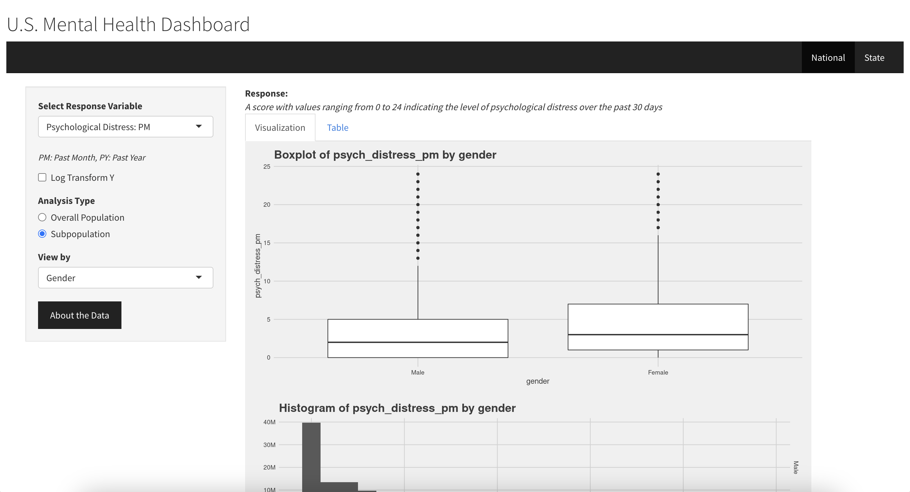
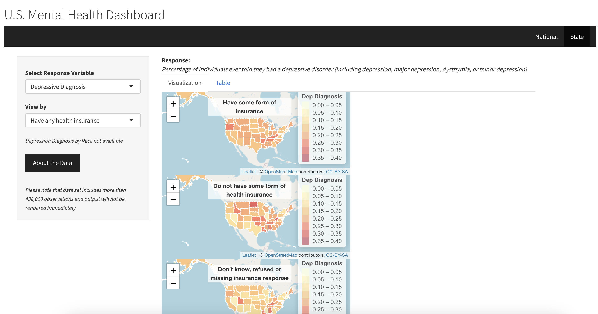

# U.S. Mental Health Dashboard

The U.S. Mental Health Dashboard is an interactive web application for exploratory data analysis that aggregates mental health statistics from two national surveys. This project aims to address the mental health crisis that adversely affects the quality of life in communities across the United States. The infrastructure and capacity to support individuals struggling with mental illness are lacking, especially in minoritized communities with higher mental health burdens due to systemic unjust policies and practices. We use data from national surveys run by the Department of Health and Human Services (DHHS) and Centers for Disease Control and Prevention (CDC) to visualize the prevalence of various mental health illnesses, and the geographic distribution of key mental health metrics for adults across the United States.The databases are integrated into an interactive web app that allows users to select response variables of interest, produce dynamic visualizations, tables, and choropleths for response variables of interest, and compare results across different subpopulations. This app could be useful to a wide range of audiences including people suffering from mental illness and those in close proximity to them, public health professionals, and epidemiologists planning studies.

The dashboard can be accessed through the following link: https://50lulw-isabel-arvelo.shinyapps.io/USMHD/

